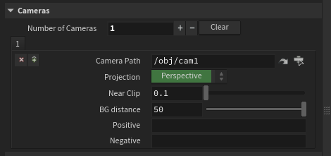

# MLOPS Stage
*Only for MLOPs 2.0+*

### SD from Scene

This high level node wraps the whole `Camera to Points` -> `Points to Mesh` pipeline

**features**:
- **Use multiparm for cameras**. A whole pipeline is created per camera. Each camera embeds its own settings and you can have per camera positive and negative prompts (on top of the global ones)  

**random preview from development**
#### The demo file. This will show you how to split the output as everything gets merged

https://github.com/melMass/MLOPs-stage/assets/7041726/44ee5543-132a-4e39-ae3e-ad1b5ae1c733

#### previewing the 2D and projected points at the same time (note that MLOPs controlnet was broken back then)

https://github.com/melMass/MLOPs-stage/assets/7041726/41b1a371-497e-46aa-a138-417ff49b49ac

#### Attempt to transfer back to mesh (this is part of the demo file)

https://github.com/melMass/MLOPs-stage/assets/7041726/de49f854-bc1b-4a61-a061-ec86d48faaec

